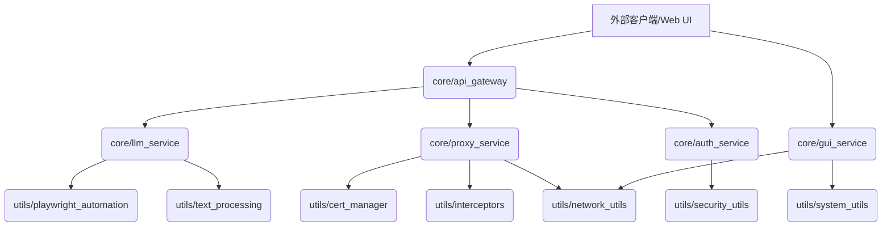

对本项目进行全面的技术重构，以提升其架构质量、可维护性、可扩展性、性能和安全性。重构将严格遵循现代软件工程的最佳实践。

## 1. 分层模块化架构

基于“项目技术分析报告”的深入分析，当前项目存在“上帝对象”和紧耦合的风险。重构目标是建立清晰、职责单一的分层模块化架构，明确各模块的 API 接口和跨模块依赖关系。

### 1.1 核心模块与 API 接口定义

将现有庞大的 `server.py` 和 `gui_launcher.py` 分解为以下核心模块，并明确其对外暴露的 API 接口：

*   **`core/api_gateway`**:
    *   **职责**: 作为所有外部请求的统一入口，处理 OpenAI API 兼容性转换、请求路由、认证/授权（如果引入）。
    *   **API 接口**:
        *   `POST /v1/chat/completions`: 处理聊天补全请求。
        *   `GET /v1/models`: 获取可用模型列表。
        *   `GET /health`: 健康检查。
        *   （未来可扩展其他 OpenAI API 兼容接口）
    *   **依赖**: 依赖 `core/llm_service`、`core/proxy_service`、`core/auth_service`。

*   **`core/llm_service`**:
    *   **职责**: 封装与 Google AI Studio 或其他 LLM 服务的交互逻辑，包括提示准备、模型参数传递、响应解析。
    *   **API 接口**:
        *   `async def query_llm(prompt: str, model_id: str, params: dict) -> AsyncGenerator[str, None]`: 异步流式查询 LLM。
        *   `async def get_available_models() -> List[str]`: 获取 LLM 服务支持的模型列表。
    *   **依赖**: 依赖 `utils/playwright_automation`、`utils/text_processing`。

*   **`core/proxy_service`**:
    *   **职责**: 封装网络代理的核心逻辑，包括连接管理、数据流转发、SSL 拦截和响应转换。
    *   **API 接口**:
        *   `async def start_proxy_server(port: int)`: 启动代理服务器。
        *   `async def handle_client_connection(reader, writer)`: 处理单个客户端连接。
        *   `async def intercept_and_transform(data: bytes) -> bytes`: 拦截并转换数据流。
    *   **依赖**: 依赖 `utils/cert_manager`、`utils/interceptors`、`utils/network_utils`。

*   **`core/auth_service`**:
    *   **职责**: 集中管理用户认证、授权和会话状态，包括 `storage_state` 的安全存储和加载。
    *   **API 接口**:
        *   `async def authenticate_user(credentials) -> bool`: 用户认证。
        *   `async def authorize_request(token) -> bool`: 请求授权。
        *   `async def load_session_state(profile_name: str) -> dict`: 加载 Playwright 会话状态。
        *   `async def save_session_state(profile_name: str, state: dict)`: 保存 Playwright 会话状态。
    *   **依赖**: 依赖 `utils/security_utils`。

*   **`core/gui_service`**:
    *   **职责**: 封装 GUI 启动、进程管理、端口检测和与 Web UI 的交互逻辑。
    *   **API 接口**:
        *   `async def launch_gui()`: 启动 GUI 界面。
        *   `async def manage_process(process_name: str, action: str)`: 管理指定进程（启动/停止）。
        *   `async def get_service_status() -> dict`: 获取服务状态。
    *   **依赖**: 依赖 `utils/system_utils`、`utils/network_utils`。

### 1.2 跨模块依赖关系图

重构后的模块应形成清晰的单向依赖，避免循环依赖。



**说明**:
*   箭头表示依赖方向（A 依赖 B）。
*   `core/` 模块是业务核心，`utils/` 模块提供通用工具。
*   `utils/` 模块不应直接依赖 `core/` 模块。

## 2. 设计原则与编码规范

重构过程必须严格遵循以下设计原则和编码规范：

*   **SOLID 设计原则**:
    *   **单一职责原则 (SRP)**: 每个模块、类、函数只负责一个明确的职责。例如，`api_gateway` 只负责 API 路由和转换，不应包含 LLM 交互或代理逻辑。
    *   **开闭原则 (OCP)**: 软件实体（类、模块、函数等）应该对扩展开放，对修改封闭。通过接口和抽象实现新功能的添加，而不是修改现有代码。
    *   **里氏替换原则 (LSP)**: 子类型必须能够替换掉它们的基类型。确保继承关系正确使用。
    *   **接口隔离原则 (ISP)**: 不应强迫客户端依赖它们不使用的接口。创建更小、更具体的接口。
    *   **依赖倒置原则 (DIP)**: 高层模块不应该依赖低层模块，两者都应该依赖抽象。抽象不应该依赖于细节，细节应该依赖于抽象。通过依赖注入实现解耦。

*   **Google 编码规范**:
    *   遵循 Python 的 PEP 8 规范。
    *   清晰的命名约定、一致的代码格式、适当的注释和文档字符串。
    *   注释和文档字符串采用简体中文。
    *   避免全局状态和可变全局变量。
    *   函数和方法长度适中，避免“长方法”和“上帝对象”。
    *   修改后的代码应能通过 `pylance` (或其他主流 Python 静态分析工具如 MyPy) 的严格检查，确保类型安全和代码质量。
    *   实现功能高内聚、模块低耦合。

*   **TODO FIXME 占位符**：
    *   在遇到**FIXME**时，及时修复。
    *   在遇到**TODO**或**占位符**时，如果问题比较简单，请予以完成。

## 3. 标准化目录结构

项目将采用以下标准化目录结构：

```
.
├── core/                 # 核心业务模块
│   ├── api_gateway/      # API 网关服务
│   ├── llm_service/      # LLM 交互服务
│   ├── proxy_service/    # 代理服务
│   ├── auth_service/     # 认证与授权服务
│   └── gui_service/      # GUI 启动与管理服务
├── utils/                # 独立工具链
│   ├── playwright_automation/ # Playwright 自动化工具
│   ├── cert_manager/     # 证书管理工具
│   ├── interceptors/     # 拦截器工具
│   ├── network_utils/    # 网络工具
│   ├── system_utils/     # 系统工具（进程管理、端口检测等）
│   ├── security_utils/   # 安全相关工具
│   └── text_processing/  # 文本处理工具
├── tests/                # 自动化测试套件
│   ├── unit/             # 单元测试
│   ├── integration/      # 集成测试
│   └── e2e/              # 端到端测试
├── docs/                 # API 设计文档与架构决策记录
│   └── 重构提示词.md     # 本文档
├── webui/                # 前端 Web UI (原 index.html, webui.js, webui.css)
├── auth_profiles/        # 认证配置文件
├── certs/                # 证书文件
├── config/               # 全局配置文件 (如日志配置、环境变量模板)
├── requirements.txt      # Python 依赖
├── Dockerfile            # Docker 构建文件
├── README.md             # 项目说明
└── ...                   # 其他顶层文件 (如 LICENSE, .gitignore)
```

## 4. 依赖管理

*   **依赖注入 (Dependency Injection)**:
    *   通过构造函数注入或属性注入的方式，将模块的依赖项（如 `llm_service` 依赖 `playwright_automation`）从外部传入，而不是在模块内部硬编码创建。这将大大降低模块间的耦合度，提高可测试性和可替换性。
    *   考虑使用 FastAPI 的依赖注入系统来管理请求范围的依赖。

*   **接口隔离 (Interface Segregation)**:
    *   定义清晰的抽象基类 (ABC) 或协议 (Protocol) 来表示模块间的契约。例如，`llm_service` 可以定义一个 `LLMProvider` 接口，不同的 LLM 实现（Google AI Studio、Ollama 模拟）都实现这个接口。
    *   客户端只依赖它们需要的接口，而不是一个庞大的通用接口。

*   **消除循环引用**:
    *   通过上述分层和依赖倒置原则，确保模块间的依赖是单向的。
    *   进行代码级别的静态分析，检测并消除任何潜在的循环导入。

*   **系统逻辑自洽性**:
    *   确保所有模块的输入和输出都明确定义，并且在整个系统中保持一致。
    *   通过类型提示 (Type Hinting) 和 Pydantic 模型进行严格的数据验证。

## 5. 自动化验证流程（四阶段）

每项重构子任务必须通过以下验证后方可标记完成：

1.  **单元测试覆盖率 ≥ 85%**:
    *   对每个核心模块和工具函数编写独立的单元测试。
    *   使用 `pytest` 和 `pytest-cov` 等工具进行测试和覆盖率报告。
    *   确保关键业务逻辑和边缘情况得到充分测试。

2.  **SonarQube 静态分析零严重缺陷**:
    *   集成 SonarQube 或其他静态代码分析工具到 CI/CD 流水线。
    *   配置严格的质量门禁，确保没有新的严重代码异味、漏洞或 Bug 被引入。
    *   定期运行分析，并解决现有技术债务。

3.  **CI 流水线门禁检查**:
    *   建立完整的 CI/CD 流水线，包括代码风格检查 (Flake8, Black)、类型检查 (MyPy)、安全扫描 (Bandit, Snyk)、单元测试、集成测试。
    *   所有代码提交必须通过 CI 门禁检查才能合并到主分支。

4.  **契约测试验证**:
    *   对于 `api_gateway` 和 `llm_service`、`proxy_service` 等模块间的 API 交互，引入契约测试 (Contract Testing)。
    *   使用 Pact 或类似工具，确保服务提供者和消费者之间的 API 契约一致性，防止接口变更导致的问题。

## 6. 额外要求
1. 所有的**子任务**完成后，请自动确认，无需人工干预。
2. **子任务**确认后，请自行再对生成的新代码进行一次检查，确保没有问题。
3. 当**主任务**进行了10轮后，需要采用以下提示词进行压缩。
    ```markdown
    Your task is to create a detailed summary of the conversation so far, paying close attention to the user's explicit requests and your previous actions.
    This summary should be thorough in capturing technical details, code patterns, and architectural decisions that would be essential for continuing with the conversation and supporting any continuing tasks.

    Your summary should be structured as follows:
    Context: The context to continue the conversation with. If applicable based on the current task, this should include:
    1. Previous Conversation: High level details about what was discussed throughout the entire conversation with the user. This should be written to allow someone to be able to follow the general overarching conversation flow.
    2. Current Work: Describe in detail what was being worked on prior to this request to summarize the conversation. Pay special attention to the more recent messages in the conversation.
    3. Key Technical Concepts: List all important technical concepts, technologies, coding conventions, and frameworks discussed, which might be relevant for continuing with this work.
    4. Relevant Files and Code: If applicable, enumerate specific files and code sections examined, modified, or created for the task continuation. Pay special attention to the most recent messages and changes.
    5. Problem Solving: Document problems solved thus far and any ongoing troubleshooting efforts.
    6. Pending Tasks and Next Steps: Outline all pending tasks that you have explicitly been asked to work on, as well as list the next steps you will take for all outstanding work, if applicable. Include code snippets where they add clarity. For any next steps, include direct quotes from the most recent conversation showing exactly what task you were working on and where you left off. This should be verbatim to ensure there's no information loss in context between tasks.

    Example summary structure:
    1. Previous Conversation:
    [Detailed description]
    2. Current Work:
    [Detailed description]
    3. Key Technical Concepts:
    - [Concept 1]
    - [Concept 2]
    - [...]
    4. Relevant Files and Code:
    - [File Name 1]
        - [Summary of why this file is important]
        - [Summary of the changes made to this file, if any]
        - [Important Code Snippet]
    - [File Name 2]
        - [Important Code Snippet]
    - [...]
    5. Problem Solving:
    [Detailed description]
    6. Pending Tasks and Next Steps:
    - [Task 1 details & next steps]
    - [Task 2 details & next steps]
    - [...]

    Output only the summary of the conversation so far, without any additional commentary or explanation.
    ```